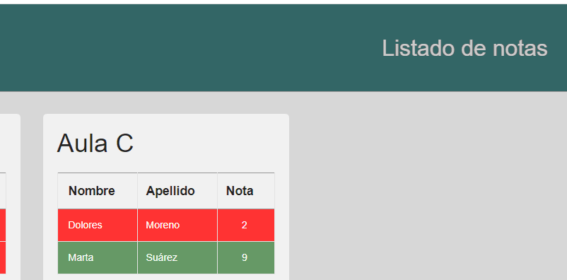

# Examen ECMASCRIPT 6 2020 - ¡Listado Notas!

La prueba consiste en completar las notas de cada aula.

Dispone de **2 Horas** para realizar el ejercicio y subirlo.

Puede descargar los recursos necesarios que contienen:

1. [index.html](index.html): Página web con la que se trabajará durante la prueba. Cualquier modificación en este archivo será descartada y no se tendrá en cuenta como resultado de la prueba.
1. Carpeta `css` conteniendo:

   1. [estilos.css](./css/estilos.css): Archivo con el estilo
   1. [grafica.css](./css/grafica.css): Archivo con el estilo de la capa de la gráfica que tendrá que implementar durante el examen.

1. Carpeta `img` con los prototipos de como debe quedar.
1. Carpeta `js` conteniendo:

   1. [index.min.js](./js/index.min.js) **NO TOCAR** archivo con los datos de la Clase `App`
   1. [325BA0BE16B1DB8711E860E8D0C91542.js](./js/325BA0BE16B1DB8711E860E8D0C91542.js) donde tiene que implementar el código de su aplicación

1. El estado de implementación actual es `body` Completado.
1. Puede utilizar las Librerías que desee si lo cree necesario.
1. En `index.html` no se puede escribir nada.
1. Se valorará positivamente el uso de funciones anónimas y arrow functions.

Al finalizar el examen hará un commit con el siguiente texto:  
_**empleo-apellido fecha y hora-fin examen JS**_ y a continuación un `push`.

A partir de aquí se pide:

1. Instanciar un objeto de la clase `App` y asignarlo a la variable `app`
   1. Imprime por consola `app` y estudia su estructura.
1. Crea un método que se llame `getNotasAula(aula)` devolverá un array de las notas de esa aula.
   1. Utiliza el siguiente método, para que devuelva un objeto con los array de las notas de cada clase.
      ```javascript
      function getNotasAulas() {
        let notasAulas = {};
        for (let aula of app.aulas) {
          notasAulas[aula] = getNotasAula(aula);
        }
        return notasAulas;
      }
      ```
   1. El método `getNotasAula()` asígnalo a una variable llamada `notasAulas`
1. Existe una variable Global que se llama `NOTACORTE`, su valor es el que marca el apto o no apto. Si la imprime por consola puede comprobar su valor.
   1. Cree un método llamado `isAprobado(nota)` que devuelva si la nota que se pasa por parámetro es aprobado o no (usa la variable `NOTACORTE`).
1. Medias de aula:
   1. Implemente un método que se llame `getMediaAula(aula)` que devuelve la media del aula que se pasa por parámetro aproximada a 2 decimales.
   1. Implementa un método que se llame `getMediaPorAula()` y devuelva un objeto que tenga la siguiente forma:
      ```json
      {
        "aulas": ["a", "b", "c"],
        "medias": ["4.87", "3.50", "5.50"]
      }
      ```
      _utilice el método `getMediaAula(aula)` que ha implementado en el apartado anterior._

   1. Asigne el método `getMediaPorAula()` a una variable llamada `mediaPorAula`
1. Implemente el método `muestraAprobados()` que está en la linea 20 del `index.html` para que muestre un `alert` cada 5 segundos con el siguiente texto:  
   **_El Número de aprobados es [salto de linea] es : (numero de aprobados según sus datos)_**
1. Complete el siguiente método, para que en la casilla de nota media de cada aula ponga su nota media y aparezca una cara sonriente de color verde (`fa-smile` y `icono-ok`) si es aprobado, si es suspenso una cara triste de color rojo (`fa-frown` y `icono-no-ok`)

   ```javascript
               function pintaTotalesAula(aula) {
                   let bloqueAulaElem = document.querySelector(`   [data-aula="${aula}"]`);
                   let totalesAulaElem = bloqueAulaElem.querySelector(".totales");
                   let notaMediaElem = totalesAulaElem.querySelector(????);
                   let notaMediaStatusElem = totalesAulaElem.querySelector   (".nota-media-status");
                   let notaMedia = ??????;
                   notaMediaElem.textContent = notaMedia;
                   if (isAprobado(?????)) {
                    ????????
                   } else {
                       ????????
                   }
               }
   ```

   _Lo que debe completar es el código que hay donde las interrogaciones_

   1. Pegue el siguiente método en su código . 

         ```javascript
       function pintaTotalesAulas() {
           for (let aula of app.aulas) {
             pintaTotalesAula(aula);
           }
         }
         ```
      _Con él hacemos que se ejecute el método `pintaTotalesAula(aula)` por cada aula_  
   1. Invoque `pintaTotalesAulas()` para que se empiecen a mostrar los datos.  

1. Añadir un listener para:

   1. Que cuando se pulse la inicial de su apellido se muestre una gráfica en el `footer` del `index.html` en la que se represente la nota media de cada aula en un diagrama de barras, estando en el eje de las x las aulas y en el eje de las y las notas medias.
   1. Que cuando se haga doble click con el ratón en la pantalla se anule el evento de teclado del apartado 6.1 y se deje de mostrar la gráfica. Implemente este listener de forma distinta a como lo hizo en el apartado anterior.


   1. Implemente lo necesario para que al hacer `click` sobre `Listado de notas`   
   se cancelen las ventanas emergentes del apartado 5.